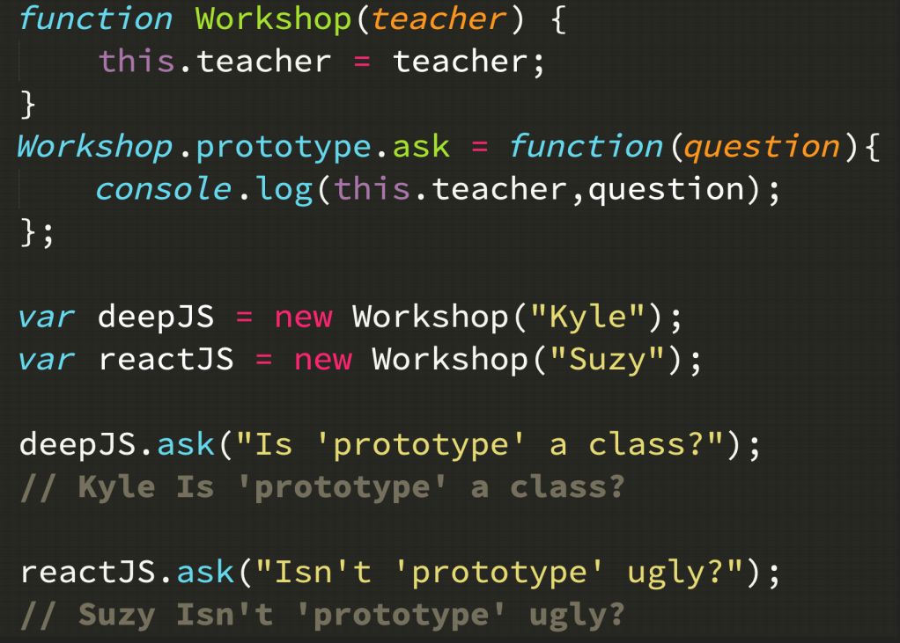
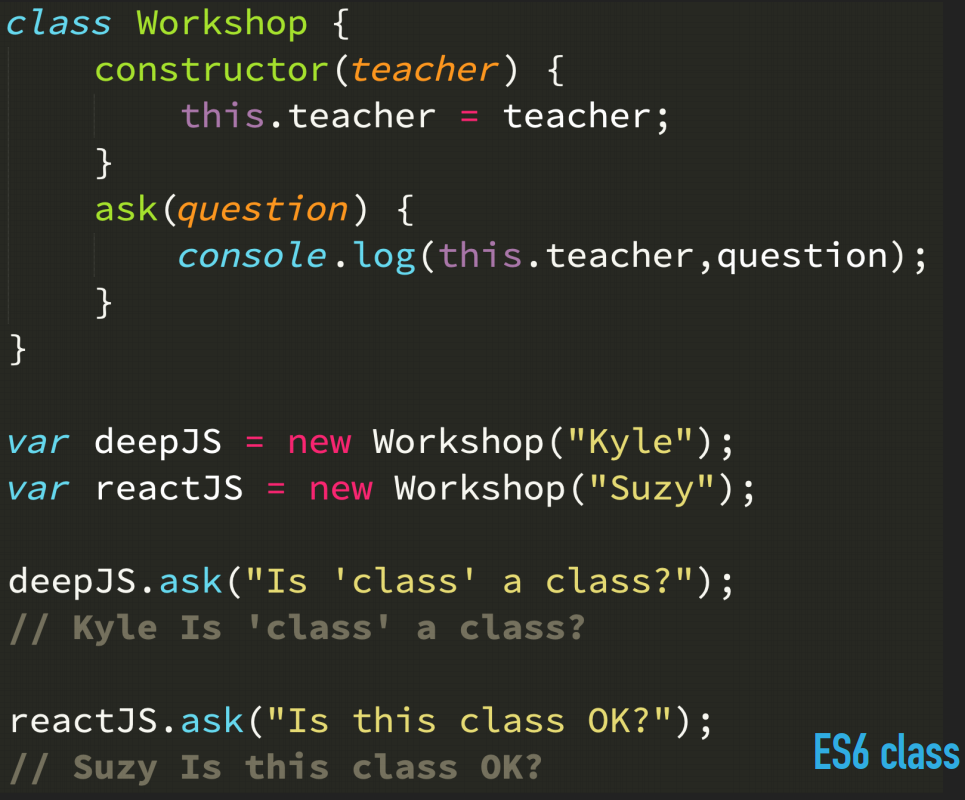

# Getting Started with JavaScript, v2

These are my personal notes taken from Kyle Simpson's course: Getting Started with JavaScript, v2, availabe at [Frontend Masters](https://frontendmasters.com/courses/getting-started-javascript-v2/). Quotes are from the book [You-Dont-Know-JS First Edition](https://github.com/getify/You-Dont-Know-JS/blob/1st-ed/README.md)

- [Course Slides](https://static.frontendmasters.com/resources/2019-05-08-getting-into-javascript/getting-into-javascript.pdf)
- [You-Dont-Know-JS Second Edition](https://github.com/getify/You-Dont-Know-JS)
- [RunJS](https://runjs.app/)

## Types

## Loops

[for...of](https://developer.mozilla.org/en-US/docs/Web/JavaScript/Reference/Statements/for...of): creates a loop iterating over iterable objects

[for...in](https://developer.mozilla.org/en-US/docs/Web/JavaScript/Reference/Statements/for...in): iterates over all enumerable properties of an object that are keyed by strings. **Should not be used to iterate over an Array where the index order is important.**

 # Three Pillars of JS
 
 1. Types / Coercion
 2. Scope / Closure
 3. this / Prototypes

## Types / Coercion

### Primitive Types

- boolean
- string
- number
- undefined
- object
- symbol

- null? (sub-type)
- function? (sub-type)
- array? (sub-type)

> In JavaScript, variables don't have types, values do.

- NaN - Not a Number

#### new

Do not use with Boolean, String, Number

### Converting Types

The way to convert from one type to another: _**Coercion**_

> A quality JS program embraces coercions, making sure the types involved in every operation are clear.

### Checking Equality

- Loose Equality (==) - Allows Coercion
- Strict Equality (===) - Disallows Coercion

## Scope / Closure

### Nested Scope

Scope: where to look for things. It looks from the innermost scope to the outermost scope.

#### undefined vs. undeclared

When we are in non-strict mode and assign an undeclared variable, it gets declared in the global scope

- **undefined**: something that has been declared but it doesn't have a value
- **undeclared**: Never declared

#### Function Expressions

A function that is assigned as a value

#### IIFE - Immediately Function Expression

We get a new block of scope there

#### Block Scoping

### Closure

> Closure is when a function “remembers” the variables outside of it, even if you pass that function elsewhere.

### this / Prototypes

#### this

> A function's **this** references the execution context for that call, determined entirely by how the function was called

- **new** binding: *this* is the newly constructed object
- **explicit** binding: *this* is the object used when we use the functions **call**, **apply**, **bind**
- **implicit** binding: when the call-site has a context object *this* is equal to that object
- **default** binding: *this* is equal to the global object
- **lexical** this: arrow functions adopt the *this* binding from the enclosing (function or global) scope

#### Prototypes

> When attempting a property access on an object that doesn't have that property, the object's internal [[Prototype]] linkage defines where the [[Get]] operation (see Chapter 3) should look next. This cascading linkage from object to object essentially defines a "prototype chain" (somewhat similar to a nested scope chain) of objects to traverse for property resolution.

#### class {}

> Classes are a design pattern. Many languages provide syntax which enables natural class-oriented software design. JS also has a similar syntax, but it behaves very differently from what you're used to with classes in those other languages.
> 
> Classes mean copies.
> 
> When traditional classes are instantiated, a copy of behavior from class to instance occurs. When classes are inherited, a copy of behavior from parent to child also occurs.
> 
> Polymorphism (having different functions at multiple levels of an inheritance chain with the same name) may seem like it implies a referential relative link from child back to parent, but it's still just a result of copy behavior.
> 
> JavaScript does not automatically create copies (as classes imply) between objects.

