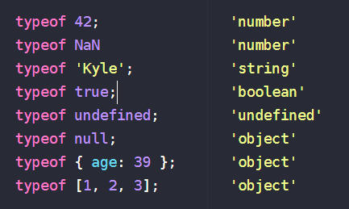

# Getting Started with JavaScript, v2

[Course Slides](https://static.frontendmasters.com/resources/2019-05-08-getting-into-javascript/getting-into-javascript.pdf)

[You-Dont-Know-JS Second Edition](https://github.com/getify/You-Dont-Know-JS)

[You-Dont-Know-JS First Edition](https://github.com/getify/You-Dont-Know-JS/blob/1st-ed/README.md)

[RunJS](https://runjs.app/)

## Types

## Loops

[for...of](https://developer.mozilla.org/en-US/docs/Web/JavaScript/Reference/Statements/for...of): creates a loop iterating over iterable objects

[for...in](https://developer.mozilla.org/en-US/docs/Web/JavaScript/Reference/Statements/for...in): iterates over all enumerable properties of an object that are keyed by strings. **Should not be used to iterate over an Array where the index order is important.**

 # Three Pillars of JS
 
 1. Types / Coercion
 2. Scope / Closure
 3. this / Prototypes

## Types / Coercion

### Primitive Types

- boolean
- string
- number
- undefined
- object
- symbol

- null? (sub-type)
- function? (sub-type)
- array? (sub-type)

> In JavaScript, variables don't have types, values do.

- NaN - Not a Number

#### new

Do not use with Boolean, String, Number

### Converting Types

The way to convert from one type to another: _**Coercion**_

> A quality JS program embraces coercions, making sure the types involved in every operation are clear.

### Checking Equality

- Loose Equality (==) - Allows Coercion
- Strict Equality (===) - Disallows Coercion

## Scope / Closure

### Nested Scope

Scope: where to look for things. It looks from the innermost scope to the outermost scope.

#### undefined vs. undeclared

When we are in non-strict mode and assign an undeclared variable, it gets declared in the global scope

- **undefined**: something that has been declared but it doesn't have a value
- **undeclared**: Never declared

#### Function Expressions

A function that is assigned as a value

#### IIFE - Immediately Function Expression

We get a new block of scope there

#### Block Scoping

### Closure

> Closure is when a function “remembers” the variables outside of it, even if you pass that function elsewhere.